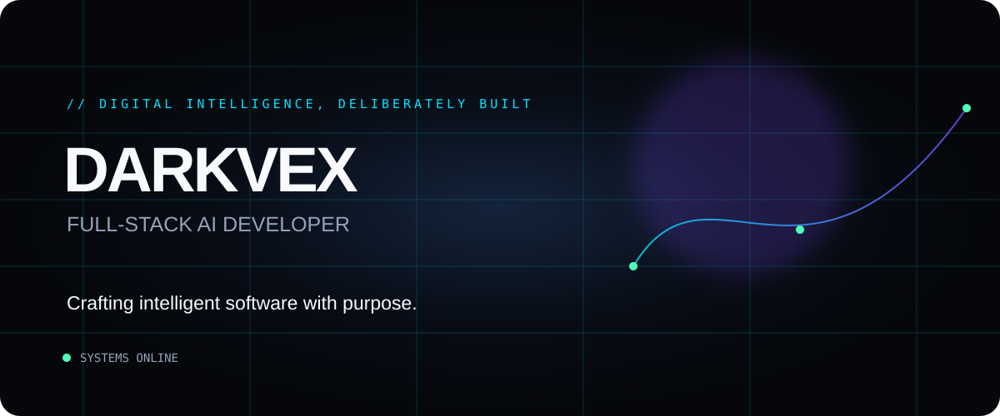
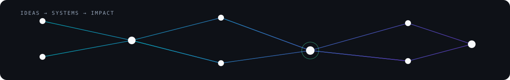
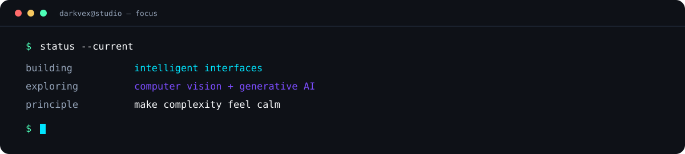
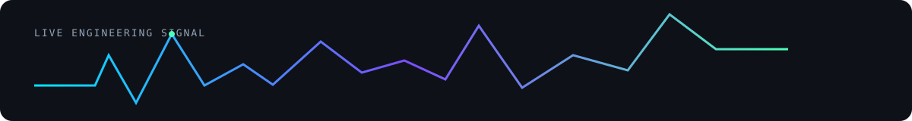
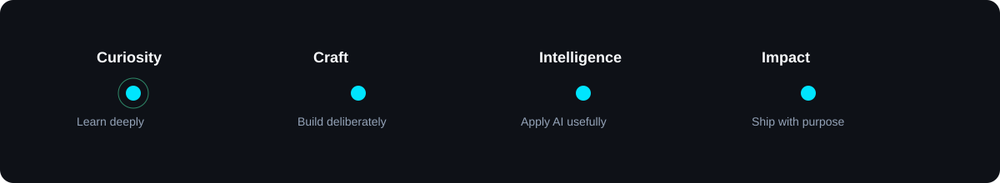
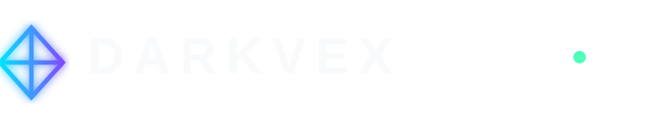

  

  <a href="#mission">Mission</a>&nbsp;&nbsp;·&nbsp;&nbsp;
  <a href="#featured-creations">Creations</a>&nbsp;&nbsp;·&nbsp;&nbsp;
  <a href="#technology-ecosystem">Ecosystem</a>&nbsp;&nbsp;·&nbsp;&nbsp;
  <a href="#connect">Connect</a>

## Mission

> **Crafting intelligent software with purpose.**

I design focused digital products where considered interfaces, dependable systems, and applied AI meet. Each build starts with a real problem and ends with an experience that earns its place in someone's day.

## Featured Creations

<table>
  <tr>
    <td width="50%" valign="top">
      <h3><a href="https://github.com/darkvex-x/Vision-IQ">Vision-IQ ↗</a></h3>
      AI LEARNING PLATFORM  
      A purposeful environment for learning with artificial intelligence.
    </td>
    <td width="50%" valign="top">
      <h3><a href="https://github.com/darkvex-x/Digi-Moi">Digi-Moi ↗</a></h3>
      DIGITAL WEDDING FINANCE PLATFORM  
      A considered way to plan the numbers behind meaningful celebrations.
    </td>
  </tr>
  <tr>
    <td width="50%" valign="top">
      <h3><a href="https://github.com/darkvex-x/Elayaraja_Memory-Card-Match">Memory Card Match ↗</a></h3>
      INTERACTIVE BROWSER GAME  
      A fast, tactile memory challenge built for the browser.
    </td>
    <td width="50%" valign="top">
      <h3><a href="https://github.com/darkvex-x/foodfacts-app">foodfacts-app ↗</a></h3>
      NUTRITION INFORMATION PLATFORM  
      Clear nutrition intelligence for better everyday choices.
    </td>
  </tr>
</table>

## Technology Ecosystem

| **Frontend** | **Backend** | **Programming** | **AI & tools** |
|:--|:--|:--|:--|
| React · Next.js · Tailwind CSS | Node.js · Express · Firebase | C++ · Python · JavaScript | Machine Learning · Computer Vision · Generative AI · Git · VS Code |

## Current Focus

**01 — Intelligent interfaces** 
Building AI features that feel natural, useful, and carefully restrained.

**02 — Full-stack systems** 
Turning product ideas into robust, end-to-end web experiences.

**03 — Better visual intelligence** 
Exploring computer vision and generative systems with practical intent.

 

## GitHub Dashboard

  
  

<!-- RECENT_ACTIVITY:START -->
<!-- RECENT_ACTIVITY:END -->

  

## In Motion

## System Status

## Connect

   
  <strong>Open to thoughtful collaboration, ambitious products, and intelligent systems.</strong> 
  <a href="mailto:elayaraja.g.s.140@email.com">elayaraja.g.s.140@email.com</a>&nbsp;&nbsp;·&nbsp;&nbsp;<a href="https://github.com/darkvex-x">GitHub</a>

